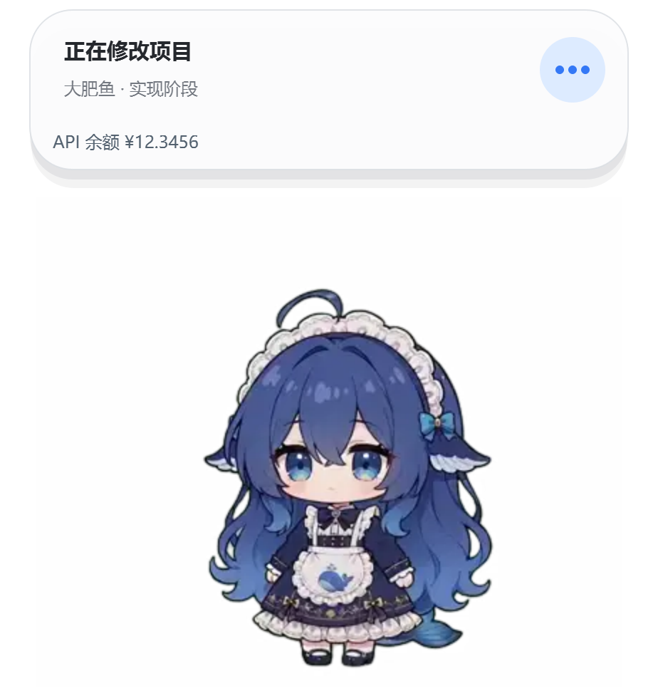

<div align="center">

# DSH BigFish 🐋

**A desktop companion for DeepSeek Harness.**

[中文](README.md) · [npm](https://www.npmjs.com/package/dsh-dafeiyu) · [Releases](https://github.com/QCYTSN/dsh-dafeiyu/releases) · [Changelog](CHANGELOG.md)

[](https://www.npmjs.com/package/dsh-dafeiyu) [](https://github.com/QCYTSN/dsh-dafeiyu/releases)

</div>

BigFish starts and stops with its DSH Host. A transparent, frameless native window keeps the Agent's task status visible while you work in other apps.

> The current stable npm release is **0.1.14**. **Balance display, DSH 0.2 settings compatibility, and official Desktop navigation** on this branch are **Unreleased**. Those features currently require a source build; installing 0.1.14 does not include them. See the [Changelog](CHANGELOG.md).



*Captured from the Windows native window with sample balance data. Current character assets come from [PC2005-cloud/dsh-pet](https://github.com/PC2005-cloud/dsh-pet). The companion's interface is currently in Chinese.*

## Features

- Real session states: thinking, searching, editing, running, verifying, waiting, success, and errors.
- Project and step information, multiple tasks, and progress supplied by DSH.
- DeepSeek balances in the native status card and settings page, with separate API-key and signed-in account sources. **Unreleased**.
- The shared Web client supports browser WebUI and official Desktop, each with its own plugin profile.
- Dragging, head pats, body pokes, tail interaction, size controls, sounds, and reduced motion.
- An optional lightweight companion inside the DSH page, disabled by default.

BigFish observes DSH session events. It does not read your screen. Reasoning effort and progress are shown only when supplied by the Host.

## Choose your client

| Client | Plugin profile | Settings | Native menu navigation (Unreleased) |
| --- | --- | --- | --- |
| Browser WebUI | `web` | Settings → Plugins → 大肥鱼 | WebUI; default `http://127.0.0.1:3080/` |
| Official Desktop | `desktop` | In-app Settings → Plugins → 大肥鱼 | Focus the app through `dsh://open` |

Installing into `web` does not install into `desktop`. Running both Hosts with BigFish enabled starts two native companions; disable it in one profile if needed. Community desktop wrappers may still use the `web` profile.

The package's `platform: web` client declaration also applies to official Desktop, which embeds the same Web client. Each Host owns its native companion.

## Install

For command-line installation, updates, or removal, fully quit the target DSH Host first and restart it afterward. When using Desktop's in-app plugin manager, follow its restart prompts.

### Browser WebUI

With a global DSH CLI:

```powershell
dsh plugin --profile web add dsh-dafeiyu
dsh web
```

With `npx`, without a global install:

```powershell
npx -y @deepseek-ai/dsh plugin --profile web add dsh-dafeiyu
npx -y @deepseek-ai/dsh web
```

From a DeepSeek Harness source checkout, run in that checkout:

```powershell
pnpm dsh plugin --profile web add dsh-dafeiyu
pnpm dsh web
```

### Official Desktop

Prefer the app's plugin manager: install the npm package `dsh-dafeiyu` and restart as instructed. Keep the detailed installation log if it fails.

For command-line installation:

1. Open Desktop once to initialize its profile, then fully quit it.
2. Use the **CLI bundled with Desktop**. Versions offering command registration expose **Manage dsh command…** in the app menu. Alternatively invoke `resources/runtime/cli/bin/dsh` directly from the app installation (`dsh.cmd` on Windows).
3. Run:

   ```powershell
   dsh plugin --profile desktop add dsh-dafeiyu
   ```

4. Reopen Desktop and select 大肥鱼 in Settings → Plugins.

The `dsh` command above must belong to Desktop. A standalone npm or `npx @deepseek-ai/dsh` CLI cannot modify the official Desktop profile. See the [official Desktop documentation](https://github.com/deepseek-ai/deepseek-harness/blob/master/apps/desktop/README.md#bundled-command-runtime).

### Release archive

Download a `.tgz` from [Releases](https://github.com/QCYTSN/dsh-dafeiyu/releases) and install it with the appropriate client's CLI. Do not unpack it first:

```powershell
# WebUI; replace the path with your downloaded file
npx -y @deepseek-ai/dsh plugin --profile web add "C:\Downloads\dsh-dafeiyu-0.1.14.tgz"

# Official Desktop; use its bundled CLI
dsh plugin --profile desktop add "C:\Downloads\dsh-dafeiyu-0.1.14.tgz"
```

## Balance display · Unreleased

Balance appears in the native status card footer and the settings page. The settings page shows total, granted, and topped-up amounts, plus manual refresh. Both clients share the Host's query and cache.

| Source | Credentials | Query |
| --- | --- | --- |
| Auto, default | DSH's DeepSeek API key first; signed-in account if no key is configured | The selected source's balance |
| API key | DSH credentials service; launch environment on older Hosts without that service | DeepSeek `/user/balance` |
| Signed-in account | DSH's DeepSeek account service | Recharge and bonus wallets |

Configure credentials in DSH's model or account settings; BigFish does not ask for another API key. API and account balances are labeled separately, as are CNY and USD. Queries run once per minute, share a cache within one Host, and limit manual refresh to once every five seconds.

A failed refresh retains the last successful result and marks it as stale. Missing credentials, authorization failures, and service failures have distinct messages. Custom API gateways must implement the same balance endpoint. Keys, login credentials, and raw upstream errors never enter the balance UI or companion event stream. Task display works without balance credentials, and balance display can be disabled.

Implementation references include [keshing/balance-display](https://github.com/keshing/balance-display) and DSH's public account service. Balance queries do not invoke a model.

## Settings

| Setting | Behavior |
| --- | --- |
| Enable BigFish | Toggle the native companion for this profile |
| Character / bubble size | Independent sizing; small bubbles retain base font sizes |
| Quiet / normal / lively | Idle micro-animation frequency |
| Reduced motion | Reduce movement and procedural motion |
| Sounds | Notifications for completion and errors |
| Bubble mode | Always, hidden, or selected states |
| Subagents | Include subagent activity in displayed states |
| In-page companion | Show a lightweight character inside DSH |
| Client target | Auto, WebUI, or official Desktop; Unreleased |
| Balance / source | Enable queries and choose the source; Unreleased |

Settings apply live. The native context menu offers size, motion, client navigation, and hide/close for the current run. Set `DSH_DAFEIYU_WEBUI_URL` when launching the Host to override the default navigation URL.

## Platforms

| Platform | Native companion |
| --- | --- |
| Windows 10 / 11 x64 | Bundled Helper; WSL2 uses Windows interoperability |
| Linux x64 | Bundled Qt Helper; graphical desktop and glibc 2.35+ required; Ubuntu 24.04 has recorded acceptance results |
| macOS 12+ | Native Swift / AppKit Universal Helper; experimental |

Release packages include the Helper. A normal installation needs neither Python nor a separately launched companion. Source development requires building the Helper. macOS still needs real-machine validation; font and partial-offscreen fixes are listed under Unreleased.

The native window appears on the machine running the Host. A remote server or a Host without a graphical desktop cannot show a native window on your browser's machine. The optional in-page companion can appear in the browser.

## Update and troubleshoot

Quit the target Host, update, and restart:

```powershell
# WebUI
npx -y @deepseek-ai/dsh plugin --profile web update dsh-dafeiyu

# Official Desktop; its bundled CLI only
dsh plugin --profile desktop update dsh-dafeiyu
```

Desktop's plugin manager is also supported. Rollback, removal, Windows `EPERM`, and restoring settings after a DSH migration are covered in [Updating and rollback](docs/UPDATING.md), currently in Chinese.

- DSH 0.2 settings: this branch adapts the new settings tab and live configuration API; stable 0.1.14 does not include the fix.
- Installation reports only `[exit 1]`: include the detailed plugin-manager log, such as `hub.log`, DSH version, OS, and install method.
- Balance unavailable: check DSH's credentials and gateway endpoint support.
- Companion missing: check the profile, enable switch, and the Host's graphical desktop.

The [issue / PR triage](docs/GITHUB_TRIAGE.md) separates implemented fixes from reports needing more evidence. [Acceptance records](docs/ACCEPTANCE.md) contain historical validation.

## Develop from source

```powershell
pnpm install --frozen-lockfile
npm test
npm run test:python
npm run build:helper
npm run test:helper:packaged
```

Python development uses `requirements.txt`; macOS needs Xcode Command Line Tools. Run `swift test` for the pure Swift core. Rebuild after native changes and install a local package archive to exercise the complete plugin.

CI also installs DSH 0.2.0-rc.2 in isolation and runs `scripts/test-dsh-settings.mjs` against its settings API. This check uses a test storage adapter and never reads user profiles or credentials.

GitHub Actions builds platform Helpers and publishes releases. See [Releasing](docs/RELEASING.md).

## Assets and licensing

Current animations come from [PC2005-cloud/dsh-pet](https://github.com/PC2005-cloud/dsh-pet), converted to transparent WebP frames at their native **24 fps**. The manifest contains 16 clips and 2,600 frames on a 412 × 344 canvas.

Code and character assets have different licenses. Read [ASSET_LICENSE.md](ASSET_LICENSE.md), the [source asset license](assets/dsh-pet-LICENSE.txt), and [LICENSE](LICENSE). Earlier assets and community dragging images remain archived under `legacy/` and are excluded from the current npm package.

Thanks to community contributors for animation, macOS, WSL, and compatibility improvements. Subscribe through **Watch → Custom → Releases** for updates; starring only bookmarks the project.
